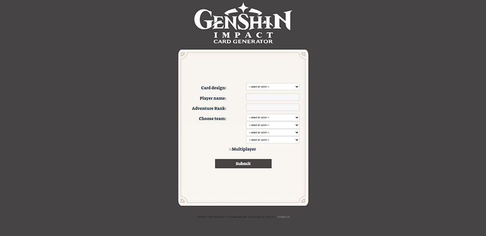
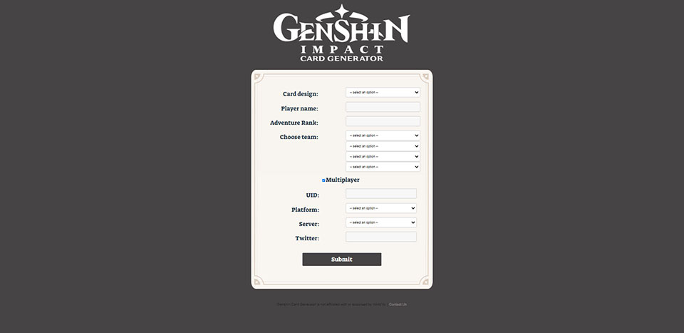
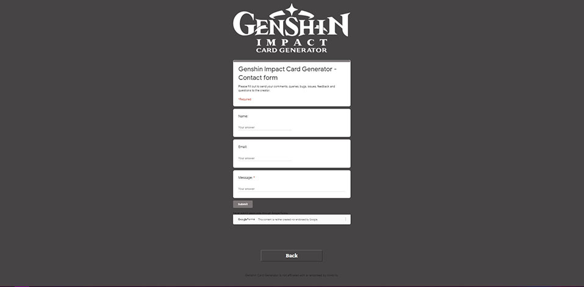
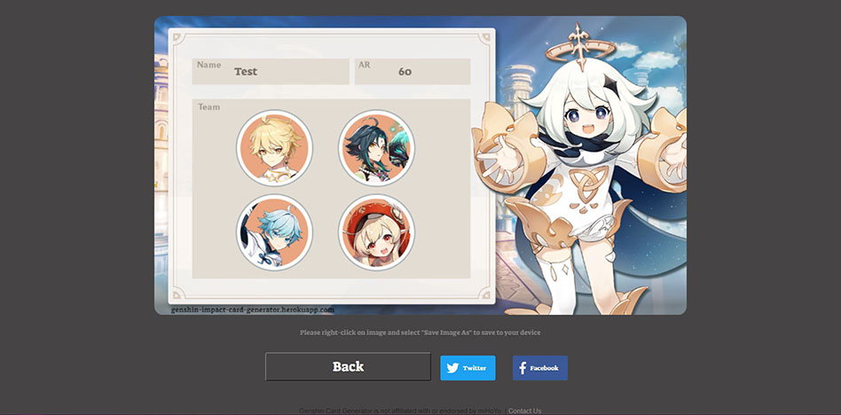
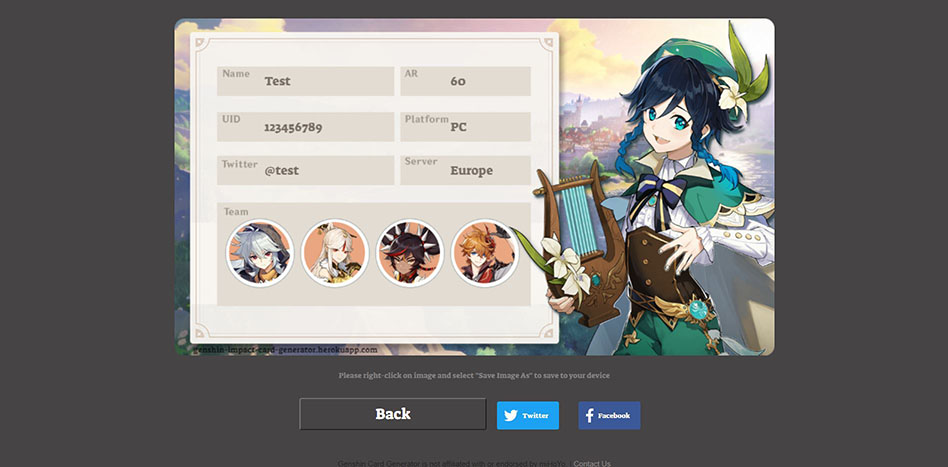

Genshin Impact Card Generator
=====
### A small web app which allows people to create a 'card' which displays their stats for the game Genshin Impact. This card can then be downloaded as a .PNG or shared to twitter 

## Website

https://genshin-impact-card-generator.herokuapp.com/

## Key Features

- Users can input the following infomation
    - Card Design
    - Player name
    - UID
    - Platform
    - Server
    - Twitter
    - Adventure Rank
    - Team
- Users will be presented with a .PNG image with their details formatted in an asetheic way
- Users can download the .PNG image
- A Twitter share button will be provided for instant shareability
- An option for the User to not include personal/ multiplayer infomation

## Screenshots
Home page

Home page with form expanded

Contact Us page with google form

Card page with non-multiplayer card

Card page with mutiplayer card

## Future Improvements:

- Attach image to twitter share button, so tweet draft includes image automatically
- Make homepage more responsive
- Add new characters when approproiate

## Technologies
[Node.js](https://nodejs.org/)

[Vue.js](https://vuejs.org/)

[Vue Router](https://router.vuejs.org/)

[Vue Konva](https://konvajs.org/docs/vue/index.html)

[vue-social-sharing](https://github.com/nicolasbeauvais/vue-social-sharing)

[Heroku](https://www.heroku.com)

## Copyright
© All rights reserved by miHoYo. Other properties belong to their respective owners.
Genshin Card Generator is not affiliated with or endorsed by miHoYo.
Assets used are owned by [miHoYo](https://genshin.mihoyo.com/)
